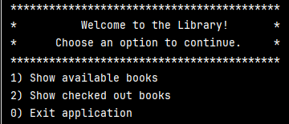
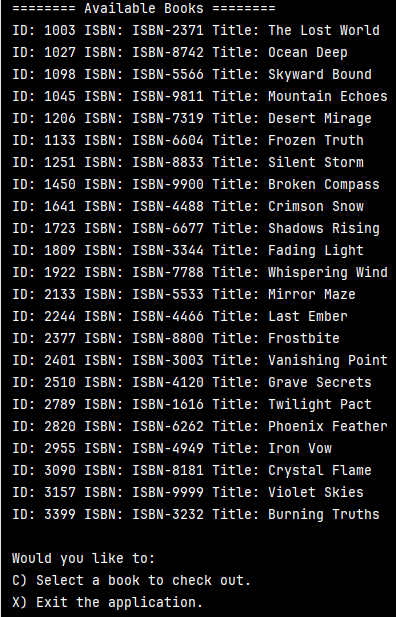
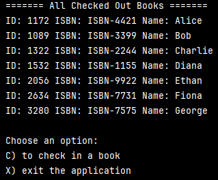
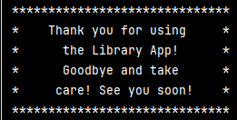
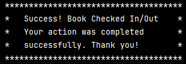

# 📚 Neighborhood Library App

Welcome to the **Neighborhood Library App**, a simple Java console-based 
application that helps manage book check-ins and check-outs.

---

## 🛠 Features

- 🔍 View all available books
- ✅ Check out/in a book by ID
- 📤 View all checked out books

---

## 🖥 How to Use

1. **Run the application** using your Java IDE or the terminal.
2. **Main Menu Options**:

- `1`: View all available books and check one out

- `2`: View all checked out books and return one

- `0`: Exit the application

3. **Follow prompts** to input your name or book ID where needed.

4. **Enjoy the ASCII art** and clear instructions along the way!